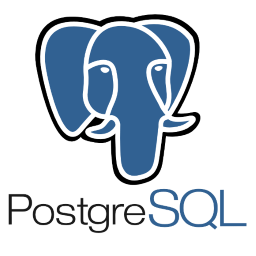

Repositório contendo um resumo do que estou aprendendo sobre **~~Banco de Dados e SGBD~~**

Esse repositório é uma junção de vários sites, blogs, documentações e cursos que estou envolvido.

Além disso, ele serve como uma consulta para relembrar alguns conceitos fundamentais.

Inicialmente, temos alguns conceitos e melhores práticas com banco de dados `PostgreSQL`.

  

